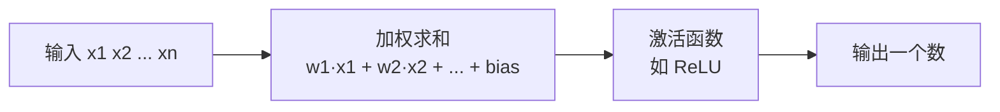
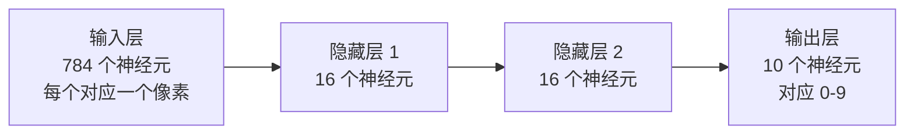
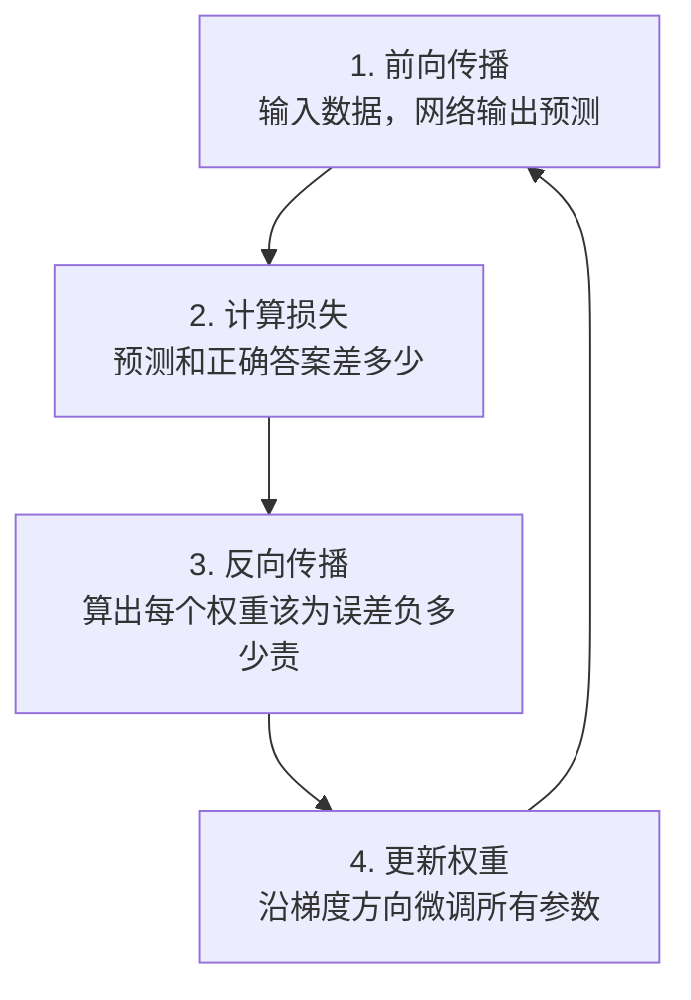
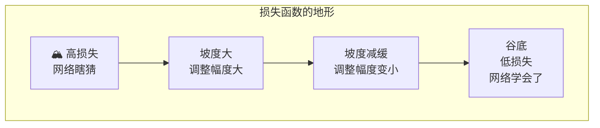
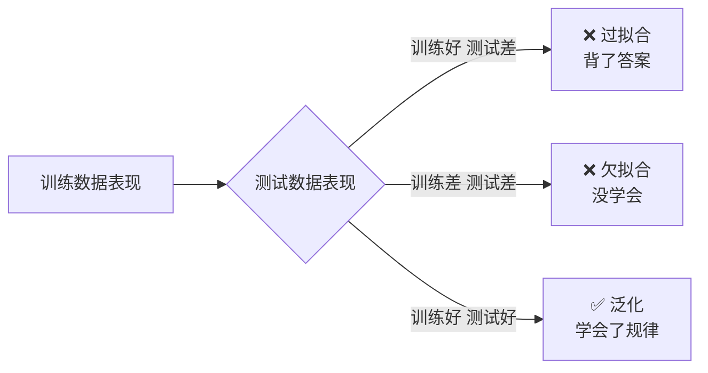
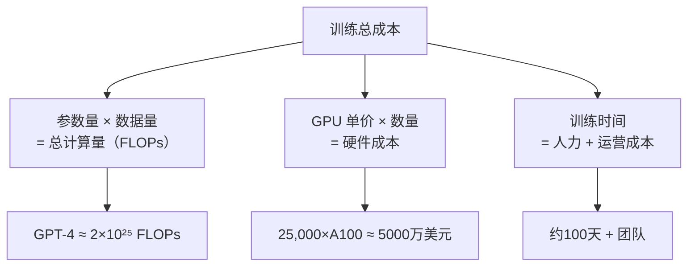

上一篇讲了 `Transformer`，这篇往回退一步 - Transformer 本质上是一个深层神经网络。不搞懂神经网络的基本运作方式，后续的训练、微调、推理优化都会变成黑箱术语。

这篇我会从最基本的问题开始：一个"神经元"到底在做什么、网络是怎么从全猜错变成能认出手写数字的、为什么这个看似简单的"猜-查-改"循环烧掉了 OpenAI 几亿美金，以及一个产品经理最该理解的几件事：训练成本的物理来源、泛化失败的根源、Karpathy 说的"Software 2.0"到底意味着什么。期望对大家有所帮助。

## 一个神经元到底在做什么

### 从手写数字说起

3Blue1Brown 用了一个经典案例 - 认手写数字。一张 28×28 像素的灰度图，每个像素是一个 0 到 1 之间的数字（0 是纯黑，1 是纯白），总共 784 个数字。神经网络的输入就是这 784 个数，输出是 0-9 中哪个数字的概率。

一个神经元做的事极其简单：

1. 接收一组输入数字
2. 每个输入乘一个权重（weight），全部加起来
3. 加一个偏置（bias）
4. 把结果塞进一个激活函数，输出一个数

就这样。一个神经元 = 加权求和 + 非线性变换。没有"思考"，没有"理解"，只有数学运算。

### 权重就是"这条信息有多重要"

3Blue1Brown 给了一个极好的直觉。在认手写数字时，如果某个像素的位置对判断"这是不是 0"很重要，网络就会给那个像素一个大的权重。比如左上角的像素如果是黑色的，那这张图大概率不是"1"（因为"1"通常是中间一条竖线，左边没有笔画）。

权重的绝对值越大，说明这条信息对最终决策的影响越大。权重可以是正数（这条特征支持这个判断）也可以是负数（这条特征反对这个判断）。

偏置（bias）的作用类似一个基准线 - 即使所有输入都是 0，偏置决定了神经元是否还是倾向于"激活"。就像面试官心里有个基准预期，即使候选人还没说话，面试官可能已经有了一个初始倾向。

### 激活函数：为什么不能只做加权求和

如果神经元只做加权求和（线性变换），那不管你堆多少层，整个网络等价于一个巨大的线性变换 - 多层线性变换的叠加仍然是线性的，深度就失去了意义。

激活函数引入非线性，让网络有能力表示复杂的、非线性的关系。几个关键角色：

| 激活函数 | 做什么 | 在哪用 | 为什么 |
|----------|--------|--------|--------|
| ReLU | 输入小于 0 输出 0，大于 0 原样输出 | 隐藏层的主力 | 计算极简，且解决了梯度消失问题 |
| Sigmoid | 把任意数字压缩到 0-1 之间 | 早期网络的输出层 | 适合做二分类的概率输出 |
| Softmax | 把一组数字变成概率分布（和为 1） | 输出层（如分类） | 多选一时的标准做法 |
| SwiGLU | ReLU 的变体，带门控机制 | 现代 LLM 的隐藏层 | GPT/Llama 系列用它替代 ReLU |

ReLU 是最值得记住的。它简单到离谱 - 负数变 0，正数不变。但正是这个函数解决了深度网络训练中的核心瓶颈（梯度消失），让从几十层到上百层的网络成为可能。

### 把神经元组装成网络

单个神经元能力有限。但当几百个神经元组成一层、多层堆叠成网络时，奇迹出现了。

还是用手写数字的例子。3Blue1Brown 展示了一个三层网络：

第一层隐藏层的每个神经元接收全部 784 个像素的输入，各自有不同的权重组合。某个神经元可能学会了检测"左上角有没有弧线"，另一个可能学会了"中间有没有竖线"。第二层隐藏层接收第一层的输出，组合出更高级的特征 - "左上有弧线 + 中间有竖线 = 可能是 6"。

层与层之间的信息传递全是矩阵乘法。784 个输入 × 权重矩阵 = 16 个输出，本质上就是一次矩阵-向量乘法。这就是为什么 GPU 对训练至关重要 - GPU 天生擅长并行做大量矩阵乘法。

这里有一个产品经理容易忽略的关键：网络的"知识"不在代码里，全在权重里。同一套网络架构，填入不同的权重，就变成完全不同的模型。这就是 Karpathy 所说的"Software 2.0"的核心 - 权重就是新的源代码。

## 网络是怎么学会的

### 训练循环：猜-查-改

神经网络的训练过程可以浓缩成四个字：猜、查、改。一个完整循环叫一次迭代：

第一步前向传播，就是数据从输入层流到输出层，每层做加权求和 + 激活函数，最后给出预测结果。一开始网络是随机初始化的，所以预测几乎全是错的。

第二步计算损失。损失函数衡量"预测离正确答案有多远"。常见的两种：

- **均方误差（MSE）** - 预测值和真实值之差的平方再取平均。差得越远，惩罚越大。
- **交叉熵（Cross-Entropy）** - 分类任务的标准选择。它衡量的不是"差多远"，而是"你把概率分布猜得有多偏"。模型对正确答案给的预测概率越低，惩罚越重。

第三步反向传播是训练的核心算法。它的作用是：已知最终的预测误差，倒推出网络中每一个权重对这个误差负多少责任。这用到了微积分的链式法则 - 从输出层往回，逐层计算每个权重对损失的影响（梯度）。

第四步更新权重。知道了每个权重的梯度，就知道了"往哪个方向调能减小误差"。梯度下降就是沿着损失下降最快的方向走一小步。

### 梯度下降：蒙眼下山

3Blue1Brown 在第二集用了一个精准的类比 - 想象你蒙着眼睛站在一座山上，目标是走到最低的山谷。你看不到全貌，但能感受到脚下地面的坡度。你会怎么做？感受坡度，往最陡的下坡方向迈一步，再感受，再走一步。

损失函数就是这座山。横轴是所有可能的权重组合（万亿维度的空间），纵轴是损失值。梯度告诉你在当前点的坡度方向。每次走的一步的"大小"叫学习率（learning rate）。

学习率太大会跳过谷底来回震荡，太小则走得太慢。Adam 优化器是当前最常用的方案 - 它会根据每个参数的历史梯度自动调整步长，相当于下山时走得稳的地方迈大步，坡度混乱的地方小心走。

### 反向传播到底在做什么

反向传播解决的问题是：当网络输出错误时，应该怪谁？

假设输出层该输出"7"但输出了"3"。反向传播逐层往回追溯：

1. 输出层：为什么给"3"的概率太高？哪些权重导致了这个问题？
2. 倒数第二层：你们传递了什么错误信号给输出层？
3. 一路追溯回输入层

每追溯一层，就利用链式法则把"误差信号"分摊到那一层的所有权重上。最终每个权重都获得一个梯度 - "如果你往这个方向调一点点，总误差能减小多少"。

3Blue1Brown 第三集的核心洞察是：反向传播就是一次性计算所有参数的梯度，而不是逐个参数试。如果一个网络有 1750 亿参数，逐个试探需要 1750 亿次前向传播，而反向传播只需要一次前向 + 一次后向传播就能算出全部梯度。这就是为什么训练在工程上是可行的。

### 一个训练循环的具体数字

把这些概念落到真实数字上：

| 模型 | 参数量 | 训练数据 | 训练成本估算 | GPU 规模 |
|------|--------|----------|-------------|----------|
| MNIST 数字识别 | ~13,000 | 60,000 张图 | 笔记本几分钟 | 单 CPU |
| GPT-2 | 15 亿 | 40GB 文本 | 数万美元 | 单台 8×V100 |
| GPT-3 | 1750 亿 | 3000 亿 token | ~460 万美元 | 数千台 V100 |
| GPT-4（估计） | ~1.8 万亿（MoE） | 13 万亿 token | ~6300 万美元 | 25,000 台 A100，约 100 天 |

GPT-4 的训练不是一次"猜-查-改"循环，而是数百万次。每次循环处理一批数据（一个 batch），用反向传播算出全部约 1.8 万亿个参数的梯度，然后微调所有参数。13 万亿 token 的训练数据被反复"看过"多轮（epoch），直到损失降到足够低。

训练成本的物理来源现在清楚了 - 每次循环需要对万亿级参数做矩阵乘法，而这恰好是 GPU 最擅长的事。GPU 越多、并行度越高，一个循环跑完就越快，训练时间就越短。但 GPU 要花钱买（一张 A100 约 1-2 万美元）或租（云上约 2-4 美元/小时），电费和散热又是另一笔开销。

## 为什么深度网络曾经不可能

### 梯度消失：深层的诅咒

理解了反向传播是"把误差信号从输出层往回传"，就会明白一个问题 - 当网络很深时，误差信号传到最初的几层时已经几乎消失了。

原因在于链式法则的连乘效应。如果每层的梯度都小于 1（比如使用 Sigmoid 激活函数，其导数最大值是 0.25），那么经过 20 层的反向传播，梯度会变成 0.25 的 20 次方 - 一个小到浮点数都表示不了的数字。前面的层收到的梯度约等于零，意味着权重几乎不更新，网络等于没在学。

这就是"梯度消失"问题，也是为什么从 1990 年代到 2012 年之前，深度学习几乎停滞了 20 年。网络堆到 3-4 层就开始训练不动。

### 三个突破让深度成为可能

| 突破 | 解决什么 | 怎么解决 |
|------|----------|----------|
| ReLU 激活函数 | 梯度消失 | 正数区域的梯度恒为 1，信号不会衰减 |
| 残差连接（ResNet） | 深层网络的信息传递 | 让信号可以"跳过"中间层直接传递 |
| GPU 大规模并行 | 训练速度 | 从 CPU 的天级到 GPU 的小时级 |

ResNet（2015 年何恺明的论文）用了一个巧妙设计 - 残差连接。它让一层的输出不仅传递给下一层，还直接"跳连"到更后面的层。反过来说，梯度也可以跳过中间层直接传到前面。这让训练上百层的网络成为可能，后来 Transformer 的设计也继承了这一思路（transformer.md 里提到的残差连接）。

### ImageNet 2012：深度学习的寒武纪大爆发

2012 年，Alex Krizhevsky 和 Ilya Sutskever（后来的 OpenAI 联合创始人）用 GPU 训练了一个 8 层的卷积神经网络 `AlexNet`，在 ImageNet 图像识别竞赛中以 15.3% 的错误率碾压了第二名（26.2%）。第二名用的是传统手工特征 + 支持向量机的方法。

这个事件的意义不仅是"深度学习更准"，而是它证明了：只要给神经网络足够大的数据 + 足够多的 GPU，性能就能随规模提升。这个信念后来被 Scaling Laws 论文精确量化，最终催生了 GPT 系列。

从 AlexNet 到 GPT-4 的 10 年间，最大的模型从 6000 万参数涨到了约 1.8 万亿参数 - 增长了 3000 倍。驱动增长的不是某个算法突破，而是"堆更多数据和算力就能变强"这一经验规律的持续验证。

## 过拟合：模型在"背答案"还是在"学规律"

### 背答案 vs 学规律

这是产品经理必须理解的最重要的机器学习概念之一。

想象一个学生准备考试。一种方式是把历年真题全部背下来 - 模拟考试分数极高，但换一套新题就抓瞎。另一种方式是理解解题方法 - 模拟考试分数可能没那么完美，但面对新题也能应对。

神经网络完全一样。

- **过拟合（Overfitting）** - 模型把训练数据的答案"背"下来了，在训练集上表现极好，但在新数据上表现差。模型没有学到真正的规律，只是记住了特定数据的特征。
- **欠拟合（Underfitting）** - 模型太简单，连训练数据的规律都没学到，训练集和测试集表现都很差。
- **泛化（Generalization）** - 模型在训练时没见过的新数据上表现良好。这才是产品的目标。

### 为什么大模型不太容易过拟合

一个违反直觉的事实：GPT-4 有 1.8 万亿参数，训练数据 13 万亿 token，但并没有严重过拟合。原因是：

1. **参数远少于数据量** - 1.8 万亿参数 vs 13 万亿 token，模型不可能记住所有数据，被迫学习压缩后的规律。
2. **训练数据足够多样** - 互联网文本涵盖了几乎所有领域和表达方式，模型必须学习通用模式才能表现好。
3. **Dropout 等正则化技术** - 训练时随机"关闭"一部分神经元，防止网络过度依赖某些特定路径。

但过拟合仍然存在 - 只是以更微妙的形式。模型可能在某些特定数据分布上表现异常好（因为训练数据中这类内容多），而在另一些分布上表现差。这就是为什么"在 benchmark 上分数高"不等于"在你的产品场景中好用"。

### 这跟做产品有什么关系

当一个销售告诉你"我们的模型在 MMLU 上达到了 89%"时，你需要追问：

1. 这个 benchmark 和你的实际使用场景有多接近？
2. 训练数据里有没有包含类似 benchmark 的内容（数据泄漏）？
3. 在你的真实数据上做小规模测试的效果如何？

benchmark 是参考，不是结论。泛化能力只有在你的场景中验证后才能确认。

## 万能近似定理：为什么神经网络理论上能学会任何东西

### 一个数学保证

万能近似定理（Universal Approximation Theorem）说的是：一个只有一个隐藏层的神经网络，只要隐藏层足够宽（神经元足够多），就能以任意精度逼近任何连续函数。

这个定理的直觉含义是 - 不管你要处理的输入输出关系有多复杂，神经网络理论上都能学会。识别猫、翻译语言、写代码 - 这些本质上都是某种函数映射，神经网络有足够的能力来表示它们。

### 但理论不等于实践

定理说的是"能表示"，不是说"能学会"。三个关键限制：

1. **可能需要天文数字的神经元** - 单层网络要逼近复杂函数，宽度可能需要指数级增长。深度网络（多层堆叠）可以用更少的总参数达到同样的效果 - 这就是为什么现代网络都追求"深"而不是"宽"。
2. **梯度下降不保证找到最优解** - 损失函数的地形不是完美的碗形，有大量的局部最优和鞍点。Adam 优化器在实际中够用，但理论上无法保证收敛到全局最优。
3. **能拟合训练数据 ≠ 能泛化** - 万能近似保证的是"表示能力"，不保证对新数据也有效。

这三个限制解释了一个看似矛盾的现象：神经网络理论上什么都能学，但实际训练时经常学不好。差距在于"表示能力"和"学习效率"是两回事。

### 为什么这对 PM 重要

因为万能近似定理，你不会遇到"这个任务神经网络原理上做不到"的情况（排除实时性要求极高的场景）。你会遇到的是"做到需要多少成本"的问题 - 多少参数、多少数据、多少 GPU、多少时间。

产品决策的真正难点不是"能不能做"，而是"在合理的成本和时间约束下能不能做到足够好"。这就是为什么理解训练成本的物理来源（参数量 × 数据量 × 迭代次数 × GPU 成本）对 PM 至关重要。

## Software 2.0：权重就是新的源代码

### Karpathy 的框架

Andrej Karpathy（OpenAI 创始团队、前 Tesla AI 总监）提出了一个影响深远的框架：

| 范式 | 代码在哪 | 怎么"编程" |
|------|----------|-----------|
| Software 1.0 | 人写的源代码 | 工程师写 if-else、函数、类 |
| Software 2.0 | 神经网络的权重 | 用数据定义目标，优化器自动找权重 |
| Software 3.0 | 自然语言 prompt | 用自然语言描述需求，LLM 直接执行 |

Software 2.0 的核心洞察是 - 当你训练一个神经网络时，你写的 Python 代码（网络架构）只是容器。真正的"程序"是训练完成后存下来的那一堆权重数字。同一套 ResNet 代码，用医疗影像训练就是医疗诊断模型，用卫星图训练就是遥感分析模型。改变的不是代码，而是权重。

### 这对产品决策意味着什么

1. **模型权重是核心资产**，不是代码。一个公司如果泄露了模型架构但没泄露权重，竞争对手也复现不了。反过来，权重的迭代和积累是长期竞争壁垒。

2. **数据是新的"需求文档"**。在 Software 1.0 里，PM 写 PRD 定义产品行为。在 Software 2.0 里，训练数据定义了模型的行为。数据的质量和分布直接决定了模型的表现。

3. **评估方式变了**。传统软件有明确的对错（运行通过或不通过）。神经网络的输出是概率性的，需要用统计方法评估。这就是为什么 LLM 产品的测试和传统软件完全不同。

## 为什么训练这么贵

### 成本的三个维度

把前面所有概念串起来，训练成本可以拆成三个维度的乘积：

| 成本项 | GPT-4 估算 | 占比 | 可优化空间 |
|--------|-----------|------|-----------|
| GPU 算力 | ~5000 万美元 | ~80% | 算法优化、更好的硬件利用率 |
| 数据准备 | ~数百万美元 | ~5% | 自动化清洗、合成数据 |
| 人力（研究+工程） | ~数百万美元 | ~5% | 团队规模 |
| 基础设施（网络/存储/散热） | ~数百万美元 | ~10% | 数据中心效率 |

GPU 占了 80% 的成本。这就是为什么 NVIDIA 在 AI 时代的市值从 3000 亿美元飙升到 3 万亿美元 - 他们卖的是 AI 训练的"石油钻井设备"。

### 推理成本也不便宜

训练是一次性投入，推理（模型部署后响应用户请求）是持续支出。每次用户向 ChatGPT 发一条消息，都会消耗 GPU 算力。这也是为什么 API 按 token 计费 - 每个 token 的生成都需要做一次前向传播（矩阵乘法），消耗真实的 GPU 时间。

这就是 transformer.md 里提到的产品启示的底层原因 - 输出 token 比输入贵 5-10 倍，因为输出生成需要逐个 token 串行计算，而输入可以一次性并行处理。

## 神经网络到 LLM 的距离

### 从图像到语言

MNIST 的网络有 13,000 个参数，认的是 784 个像素。GPT-4 有约 1.8 万亿参数，处理的是数万 token 的上下文。中间发生了什么？

| 维度 | MNIST 网络 | GPT-4 |
|------|-----------|-------|
| 输入 | 784 个像素值 | 数万个 token 的 embedding 向量 |
| 架构 | 全连接层 | Transformer（含自注意力） |
| 参数量 | ~13,000 | ~1.8 万亿 |
| 任务 | 分类（10 选 1） | 预测下一个词（词表 10 万选 1） |
| 训练数据 | 60,000 张图 | 13 万亿 token 文本 |

从 MNIST 到 GPT-4，底层原理完全一样 - 权重 + 激活函数 + 梯度下降 + 反向传播。变化的只是：

1. **架构** - 从简单全连接层换成了 Transformer（更适合处理序列数据，支持并行计算）。
2. **规模** - 参数量增长了 1 亿倍，训练数据增长了几百万倍。
3. **训练目标** - 从"分类"换成了"预测下一个词"，后者天然需要理解语言的语法和语义。

Transformer 不是神经网络的替代品，它是神经网络的一种特殊架构。理解了神经网络的基础，再看 Transformer 就不会觉得它是全新的东西 - 只是注意力机制让信息在序列中的传递方式更高效了。

### 剩下的概念链

理解了神经网络基础，接下来 12 天的概念就能串起来：

- **Tokenization**（Day 2）- 文字怎么变成神经网络能吃的数字
- **Transformer 架构进阶**（Day 3）- 现代网络的具体设计
- **预训练**（Day 4）- 上面讲的训练过程在大规模数据上怎么做
- **对齐**（Day 5）- 预训练完的模型怎么通过进一步训练变成"好用的助手"
- **推理优化**（Day 6）- 训练好的模型怎么低成本地响应用户请求

每个概念都不是孤立的，它们都在回答同一个链条上的不同问题：如何用数学运算和梯度下降，从数据中提炼出有用的模式。

---

- 3Blue1Brown 神经网络系列：[youtube.com/playlist?list=PLZHQObOWTQDNU6R1_67000Dx_ZCJB-3pi](https://www.youtube.com/playlist?list=PLZHQObOWTQDNU6R1_67000Dx_ZCJB-3pi)
- Karpathy "Software 2.0" 原文：[medium.com/@karpathy/software-2-0-a64152b37c35](https://medium.com/@karpathy/software-2-0-a64152b37c35)
- GPT-4 训练成本分析：[newsletter.semianalysis.com/p/gpt-4-architecture-infrastructure](https://newsletter.semianalysis.com/p/gpt-4-architecture-infrastructure)
