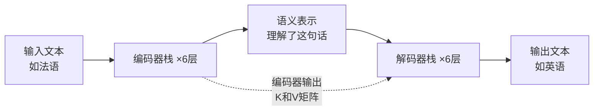
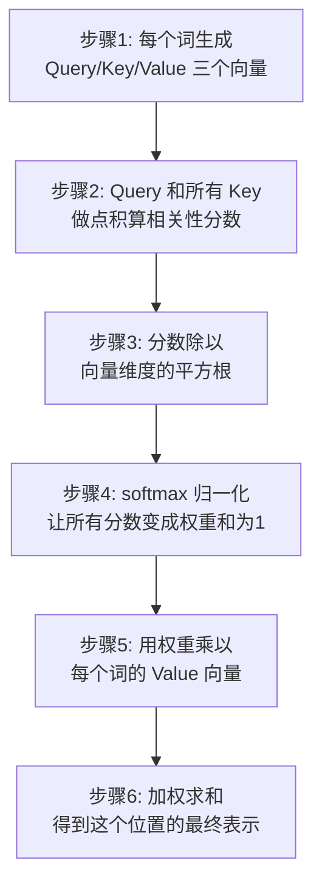
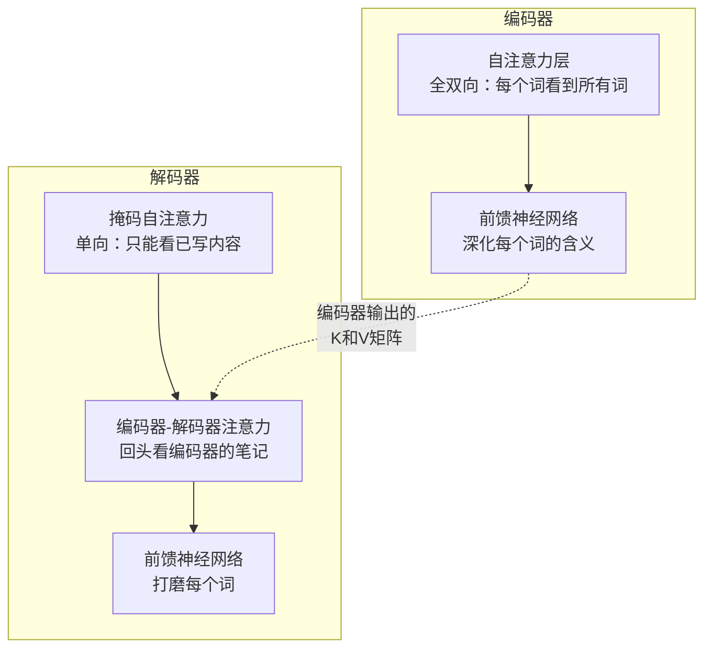
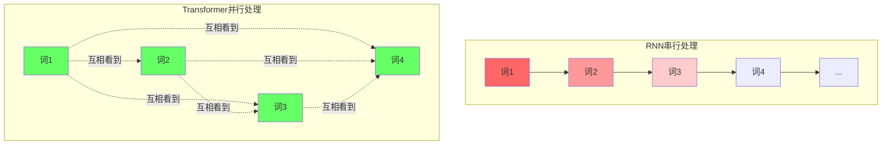
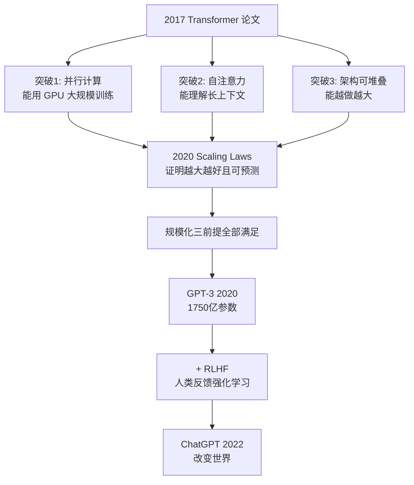
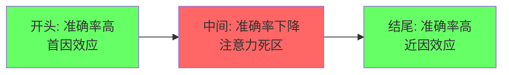
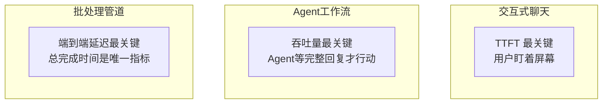

GPT、Claude、Gemini，今天所有大语言模型的底层架构都是同一个东西 - `Transformer`。2017 年 Google 的论文《Attention Is All You Need》提出了它，标题本身就点明了核心：你只需要注意力机制，别的都不需要。

这篇我会把 Transformer 从头到尾梳理一遍 - 注意力机制到底在做什么、编码器和解码器各自的工作、为什么"预测下一个词"能产生连贯文本、为什么 GPT 不可能基于上一代技术做出来，以及一个产品经理最需要理解的问题：Transformer 的能力边界在哪，它对产品设计决策意味着什么。期望对大家有所帮助。

## Transformer 到底是什么

Transformer 是 2017 年 Google 团队在论文《Attention Is All You Need》中提出的神经网络架构。它用一种叫自注意力机制（Self-Attention）的方法，彻底取代了之前 AI 处理文本的方式，成为今天所有大语言模型的地基。



它解决了前一代技术的三个致命问题：

| 问题 | 旧技术（RNN）的困境 | Transformer 的解法 |
|------|---------------------|---------------------|
| 处理效率 | 必须"逐词串行"处理，像工厂流水线，前一个词处理完才能处理下一个 | 所有词同时并行处理，像建筑工地多队同时开工 |
| 长距离理解 | 信息会"衰减" - 第 1 个词的含义传到第 100 个词时几乎丢失，像"传话游戏" | 任意两个词直接关联，像视频会议可以随时对话任何人 |
| 可扩展性 | 扩大规模像"盖平房" - 想盖高就得重打地基 | 扩大规模像"搭乐高" - 加积木就行，支撑了从百万到万亿参数的飞跃 |

## 注意力机制到底在做什么

### 一个直觉：同一个词在不同语境下意思完全不同

3Blue1Brown 用过一个极其直观的例子 - 三个句子里的 mole：

- American shrew **mole**（一种动物）
- One **mole** of carbon dioxide（化学单位）
- Take a biopsy of the **mole**（皮肤病变）

人在读到这些句子时，会根据上下文自动理解 mole 的不同含义。但 AI 一开始看到 mole 时，它的理解是完全一样的 - 一个脱离语境的固定向量。注意力机制的作用，就是让周围的词"告诉"这个词：你在这个句子里到底该是什么意思。

### 最适合产品经理的类比：班级自我介绍

旧方式（RNN）是同学们按座位顺序逐个站起来说："我只记得上一个同学说了什么。" 排到第 30 个同学时，早就忘了第 1 个。

注意力机制换了玩法 - 所有人同时站起来，每个人手里举着三样东西：

| 概念 | 通俗理解 | 类比 |
|------|----------|------|
| Key（关键词牌） | 我能提供什么信息 | 每本书的标题 |
| Value（详细介绍） | 我的具体内容 | 书的实际内容 |
| Query（需求牌） | 我在找什么信息 | 你在图书馆检索的关键词 |

你拿着自己的需求牌（Query），和所有人的关键词牌（Key）逐一比对。和你需求越匹配的人，你越认真听他的介绍，最后把所有人的介绍按"认真程度"加权整合，形成你对这句话的最终理解。

Jay Alammar 用过一个更具体的例子。句子 The animal didn't cross the street because **it** was too tired - 当模型处理到 it，注意力让 it 去环顾整句话，发现它和 animal 最相关（因为动物才会 tired），于是把 animal 的含义融入到 it 的理解中。

### 自注意力的计算步骤

整个匹配过程分六步，看起来很多但每一步都很简单：



Jay Alammar 的解释更直觉 - Query 和 Key 越匹配（点积越大），注意力权重越高。就像你拿着招聘需求（Query）和一堆简历（Key）比对，技能越匹配的候选人，你越认真看他的详情（Value）。

### 多头注意力：多支手电筒

一个注意力头就像一支手电筒，每次只能照亮句子的一个方面。但一句话里有很多种关系需要理解 - 主谓关系、形容词和名词的搭配、因果、代词指代...... 如果只用一支手电筒，太浪费了。

原论文给了 8 支手电筒（8 个注意力头），每支聚焦不同类型的关系。有的专家专门看语法依赖（it 指代哪个名词），有的看语义关联（因果关系），有的看逻辑连接（but 前后的转折）。最后把 8 个专家的分析整合，得到比单个专家更全面的理解。

论文原文的可视化也证实了这一点 - 不同注意力头确实学到了不同任务，有的专门做指代消解（its 指向 Law），有的捕捉长距离短语关联（making...more difficult）。

### 位置编码：给词贴上座位号

Transformer 没有像 RNN 那样天然按顺序处理，所以需要额外告诉它每个词在哪个位置。就像给排队的人贴编号 - 不仅能看出谁在第 1 位、谁在第 10 位（绝对位置），还能算出两人之间差几格（相对位置），而且不管队伍多长都能生成新编号。

## 编码器负责理解，解码器负责生成

原始 Transformer 为机器翻译设计，有两个部分。编码器像做阅读理解题 - 全双向，每个词都能看到句子中所有其他词，建立完整的上下文理解。解码器像写作文 - 单向，只能看已写的内容，不能偷看后面还没写的。



### 编码器的关键特点

编码器的自注意力是全双向的 - 每个词都能看到句子中所有其他词（前面和后面），所以能建立完整的上下文理解。就像你可以反复翻阅一篇文章做阅读理解。处理过程分三步：

1. 通读全文（多头自注意力）- 划出所有词之间的关联（原因到结果、主体到动作）
2. 深化每个词的含义（前馈网络）- 比如猫不只是动物，还是动作坐的执行者
3. 不忘记原文（残差连接）- 深化语义时不会因为关注某一点而丢失整体信息

### 解码器为什么要遮住未来

模型在生成第 3 个词时，只能看第 1、2 个词，不能偷看后面还没写的草稿。训练时如果模型在生成第 3 个词时能看到第 4 个词（答案），那就等于作弊。所以用掩码把未来位置强制设为零，逼模型真正学会根据已知内容预测下一个词。

就像考试时老师用手遮住后面的题目 - 你只能根据当前已知的题目往下推，不能翻到后面看答案。

一个很多产品经理不知道的事实：现代大模型（GPT 系列）只用了解码器部分。编码器路线的代表是 Google 的 BERT，专精文本理解，用于搜索和分类。

## 文字接龙：为什么预测下一个词能产生连贯文本

模型在生成文本时，本质上就是反复做一件事 - 根据已有的所有内容，预测最可能出现的下一个词。

3Blue1Brown 的解释最为精辟。想象输入了一段推理小说，结尾是 Therefore the murderer was... 模型要准确预测下一个词，序列中最后一个向量必须经过层层注意力处理后，把整本小说的所有关键信息都压缩进去 - 凶手是谁、动机、不在场证明...... 然后才能猜出正确的名字。

```
已知："我今天"        → 预测 → "去"
已知："我今天去"      → 预测 → "公司"
已知："我今天去公司"  → 预测 → "开会"
已知："我今天去公司开会" → 预测 → "了"
```

每生成一个新词后，它就变成已知信息的一部分，参与下一个词的预测。这就像多米诺骨牌 - 每一块倒下的姿态都受之前所有骨牌的影响。注意力机制确保模型在预测每个新词时，都能看到并综合考量之前所有内容。

连贯性来源是两件事 - 注意力机制让模型始终关注全局，加上海量训练数据让模型学会了语言的概率分布。模型从几十万亿字文本中学习什么词后面最可能接什么词，见过越多高质量文本，接龙越准确。这就是为什么训练数据的质量和数量至关重要。

### 选词方式：贪婪 vs 束搜索

模型每步预测的是整个词表上每个词的概率分布，然后从中选词：

| 方式 | 做法 | 类比 |
|------|------|------|
| 贪婪解码（Greedy） | 每次选概率最高的词 | 考试只选每道题最有把握的答案，走一步看一步 |
| 束搜索（Beam Search） | 同时保留多个候选，综合比较后选整体最优 | 同时准备几套方案，走到最后选总成绩最好的那条路 |

## 为什么 GPT 不可能基于 RNN 做出来

这个问题值得想清楚。

### RNN/LSTM 的两个死结

Transformer 之前处理文本的主流技术是 RNN 和 LSTM。它们有一个共同的工作方式 - 按顺序逐词处理，把上一步的记忆传给下一步。

第一个死结是长距离依赖退化。100 个人排成一排玩传话游戏，第 1 个人的一句话传到第 100 个人时已经面目全非。RNN 处理长句就是这样 - 句子越长，信息丢失越严重（数学根源叫梯度消失）。LSTM 通过门机制部分缓解了这个问题，但距离达到几百个 token 以上时，性能仍然退化。

第二个死结更致命 - 无法并行计算。必须先处理完第 1 个词才能处理第 2 个词，GPU 的并行计算能力完全无法发挥。

### RNN 串行 vs Transformer 并行



Transformer 的自注意力机制同时解决了这两个问题。所有词同时并行处理，任意两个位置直接计算关系，与距离无关。如果把 RNN 比作流水线（100 个零件逐个过），Transformer 就像一个有 100 个工位的工厂，所有零件同时加工。

### 规模化的三个前提

GPT-3 有 1750 亿参数，在 3000 亿 token 上训练。要让这样规模的训练可行，必须满足三个前提，而 RNN/LSTM 在每一条上都过不去：

| 规模化前提 | RNN/LSTM | Transformer |
|---|---|---|
| 能用大规模算力并行训练 | 顺序处理，GPU 无法并行 | 自注意力天然并行 |
| 能处理超长上下文 | 长距离依赖退化 | 任意距离直接连接 |
| 越大越强且可预测 | 性能不可预测地停滞 | 近乎线性的 Scaling Laws |

### 从 Transformer 到 ChatGPT 的完整因果链



2020 年 Kaplan 等人的 Scaling Laws 论文是第二个关键拼图。他们训练了超过 200 个 Transformer 语言模型，横跨 7 个数量级的计算量，发现了一个简洁的规律 - 模型越大、数据越多、算力越多，性能就越好，而且可以精确预测。这让大科技公司敢于投入数千亿美元买 GPU。

结论很直接：不是 Transformer 碰巧比 RNN 强一点，而是 RNN 的架构基因里就缺少规模化的三个必要条件。即使给 RNN 无限的算力和数据，它的顺序依赖也意味着训练 1750 亿参数的模型在物理上几乎不可能完成。

## 这跟做产品有什么关系

### 幻觉是架构特性而非 Bug

Transformer 的理解本质是统计模式匹配，不是因果推理。它追求概率最高的下一个词，不追求事实正确。

ChatGPT 的幻觉率约 15-20%。一项研究分析 115 条 ChatGPT-3.5 提供的引用，47% 完全捏造。OpenAI 2025 年的研究揭示了根本原因 - 训练机制内在激励自信猜测。下一个 token 预测目标惩罚"我不知道"的回复，模型学会了虚张声势。RLHF 进一步放大了这个倾向 - 人类反馈往往偏好详细、自信的回答，而非谨慎、平衡的回答。

产品层面的启示：不要追求零幻觉，追求校准的不确定性。系统应该透明地标记不确定，并在不确定时安全地拒绝回答。Prompt 工程可以将 GPT-4o 幻觉率从 53% 降到 23%，但单独调 Temperature 几乎无效。

### 上下文窗口的标称容量不等于有效容量

OpenAI 称 GPT-4o 支持 128K token，但"能处理"和"能理解"是两回事。Stanford 的研究发现 LLM 对上下文不同位置信息的注意力呈 U 型曲线 - 开头和结尾的准确率高，中间的准确率显著下降。这个模式在 4K、16K、32K 窗口中都存在，更大的窗口不能解决，反而意味着更多中间会丢失。



产品层面的启示：不要把最重要的信息放在中间。在 RAG 系统中，将最高置信度的检索文档放在开头和结尾。用重排序器选择 Top 3-5 最相关的块，而不是堆砌 20 个。

### 延迟不是一个数字

不同产品类型关注的延迟指标完全不同：



TTFT（首 Token 延迟）低于 300ms 感觉即时，超过 1 秒用户认为出错了。成本方面，输出 token 比输入贵 5-10 倍，产品设计应该有意识地控制输出长度。

### 效果评估已超越 BLEU/ROUGE

传统指标假设有少数正确答案，但 LLM 的回答可以有一千种有效形式。一个流畅但自信地错误的回答和一个流畅且正确的回答在 BLEU/ROUGE 下得分相同。

现代评估框架的核心指标：

- 忠实性（Faithfulness）- 回答中有多少声明被来源支持，低于 0.8 视为幻觉风险
- LLM-as-a-Judge - 用强 LLM 按 Rubric 打分，与人类偏好一致率超 80%
- RAG 三元组 - 上下文精确率/召回率/忠实性/回答相关性，定位故障发生在哪个环节

## 产品经理决策清单

| 场景 | 推荐策略 | 核心风险 | 评估重点 |
|------|----------|----------|----------|
| 文本生成/创作 | Transformer 最擅长 | 输出不稳定 | 人工抽检 + LLM Judge |
| 客服/QA | 成熟方案，RAG 增强 | 幻觉误导用户 | 忠实性 + 回答相关性 |
| 代码辅助 | 高频调用场景 | 吞吐量瓶颈 | HumanEval + pass@k |
| 翻译 | 高资源语言可靠 | 低资源语言幻觉 | 按语言对分别评估 |
| 摘要 | 需忠实性保障 | 歪曲源文 | 忠实性大于 0.8 |
| 法律/医疗 | 高风险，需人工审核 | 幻觉成本极高 | 忠实性 + 人工双重验证 |
| 精确推理 | 不可靠 | 逻辑链断裂 | 专项测试 + 传统逻辑兜底 |

UX 设计的核心原则：透明呈现不确定性、流式输出、引用来源、人机协作、预期管理。产品成功的核心是在 Transformer 的能力边界内设计产品，而非假设它能做到一切。

---

下一篇会从 Transformer 的封闭特性出发 - 模型只会说，不会做 - 讲到 ReAct 如何让 LLM 从回答问题变成完成任务。
